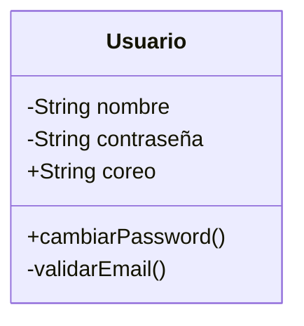

# 6.2.Bateria-de-ejercicios

## Ejercicio 1 

```mermaid
classDiagram
    Usuario : -String nombre
    Usuario : -String contraseña
    Usuario : +String coreo
    Usuario : +cambiarPassword()
    Usuario : -validarEmail()
```
